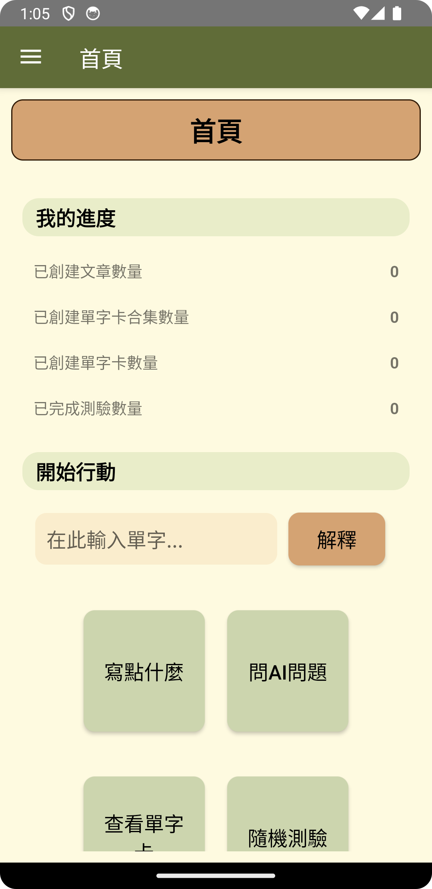
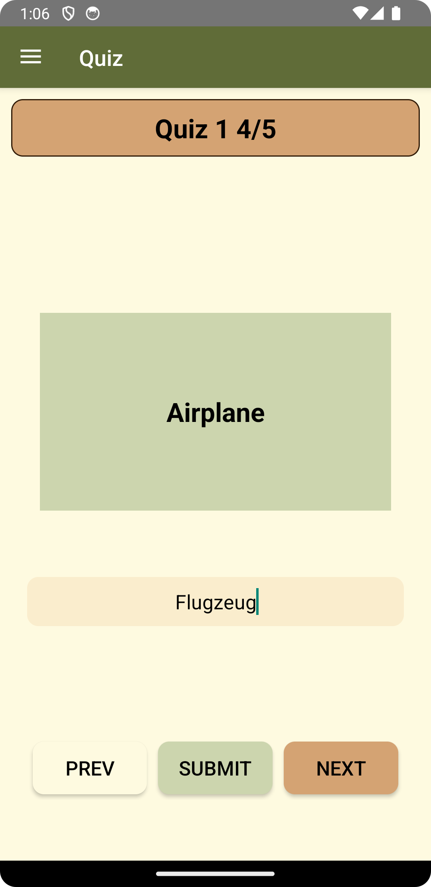
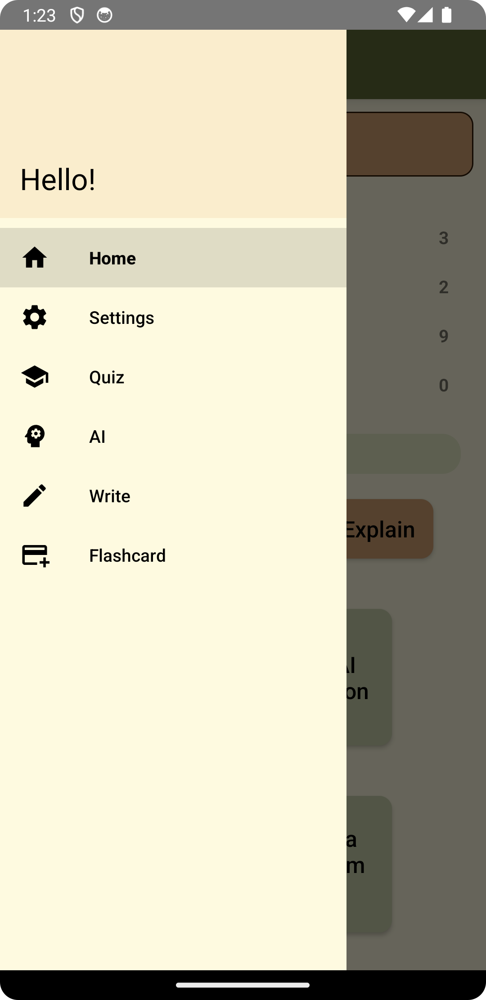

<p align="center">
  <a href="https://example.com/">
    
  </a>

  <h3 align="center">Languee</h3>

  <p align="center">
    a native language learning android app using Java
    <br>

  </p>
</p>
<br/>
<p align="center">



</p>

# Table of Contents

- [Table of Contents](#table-of-contents)
- [Quick Start](#quick-start)
  - [How To Use](#how-to-use)
    - [Installation using apk](#installation-using-apk)
    - [First Setup (optional)](#first-setup-optional)
  - [How To Test (for developers)](#how-to-test-for-developers)
- [Folder Hierarchy](#folder-hierarchy)
- [Home Page](#home-page)
  - [Navigation Panel](#navigation-panel)
  - [My Progress](#my-progress)
  - [Vocabulary Explain](#vocabulary-explain)
  - [Start Action](#start-action)
    - [Write Something](#write-something)
    - [Ask AI Question](#ask-ai-question)
    - [View a Flashcard Set](#view-a-flashcard-set)
    - [Start a random quiz](#start-a-random-quiz)
- [Features](#features)
  - [Write](#write)
    - [Create an article](#create-an-article)
    - [Viewing and editing](#viewing-and-editing)
    - [Sorting](#sorting)
    - [Filtering](#filtering)
    - [Delete an article](#delete-an-article)
    - [Check article with AI](#check-article-with-ai)
  - [Ai](#ai)
    - [Prerequisite](#prerequisite)
    - [Ask general questions](#ask-general-questions)
    - [Ask specific questions](#ask-specific-questions)
    - [Clear chat history](#clear-chat-history)
  - [Flashcard](#flashcard)
    - [Create a flash card set](#create-a-flash-card-set)
    - [View the flashcard set](#view-the-flashcard-set)
    - [Edit a flash card set](#edit-a-flash-card-set)
    - [Sorting](#sorting-1)
    - [Filtering](#filtering-1)
    - [Delete a flashcard set](#delete-a-flashcard-set)
  - [Quiz](#quiz)
    - [Create a quiz](#create-a-quiz)
    - [Attempt a quiz](#attempt-a-quiz)
    - [Review a quiz result](#review-a-quiz-result)
    - [Sorting](#sorting-2)
    - [Filtering](#filtering-2)
    - [Delete a flashcard set](#delete-a-flashcard-set-1)
- [Settings](#settings)
  - [Language](#language)
  - [Daily Reminder](#daily-reminder)
  - [Google Gemini API Key](#google-gemini-api-key)
  - [Import default data](#import-default-data)
  - [Clear all data](#clear-all-data)


# Quick Start

## How To Use
### Installation using apk
1. Put `Languee.apk` from `build` folder onto your phone
2. Open and install `Languee.apk` on your phone
3. If your phone does not allow install unknown apps, go to settings to give permission
4. Open the application


### First Setup (optional)

5. Click `Allow` button when asking permission for notification.   
    _Note: Languee will not send notification untill you have set time for [Daily Reminder](#daily-reminder)_
6. Open [Navigation Panel](#navigation-panel) by clicking the top-left button
7. Click `Settings`
8. Click `IMPORT`. It will load the default data for you to explore.

## How To Test (for developers)

Recommended testing on Android Studio
1. Open Android Studio
2. Choose `Open`
3. Select `source/App` folder. **[NOT app folder]**
4. Follow the instruction from Android Studio

For testing, if your android studio cannot open the project, please consider using either of the following android studio version.
- Hedgehog | 2023.1.1 Patch 2 (Windows 11 Enterprise 23H2)
- Jellyfish | 2023.3.1 (macOS Sonoma 14.4)

<p align="right">(<a href="#table-of-contents">Table of Contents</a>)</p>

# Folder Hierarchy

```text
3320_proj_final_22/
└── build/
    └── Languee.apk
└── images/
    └── ...
└── source/
    └── App/
        └── app/
            └── ...
        └── gradle/
            └── ...
        └── ...
└── README.md
└── report.pdf
```

<p align="right">(<a href="#table-of-contents">Table of Contents</a>)</p>

# Home Page

## Navigation Panel
1. Click the top-left button to open the panel  
    

2. The Navigation Panel will be shown on the left side.  
    

## My Progress
Your progress will be shown under `My Progress`

## Vocabulary Explain
> IMPORTANT: AI support needed. Some countries or regions are not available.  [Check here](#prerequisite)  

1. Input your word next to the `Explain` button
2. Click `Explain` button to continue
3. You will be navigated to [AI Page](#ai) after clicking it.
4. Wait Patietly for the AI to generate a response.

## Start Action

### Write Something
Write something will direct you to the [Write Page](#write). You can immediately start to write down your feelings, experience, or anything you want. After that, you can also check your writing with the AI function ([Check article with ai](#check-article-with-ai))

### Ask AI Question
> IMPORTANT: AI support needed. Some countries or regions are not available.  [Check here](#prerequisite)  

This action will direct you to the [AI Page](#ai) and setting the ai mode to `Free` initially. You can not only ask question about language learning, but also ask general question.

### View a Flashcard Set
> IMPORTANT: At least one flashcard set has to be created first

After clicking it, you will be directed to [Flashcard Page](#view-the-flashcard-set) and randomly opened a flashcard set.

### Start a random quiz
> IMPORTANT: At least one quiz has to be created first. If all quiz has been finished already, it will randomly choose one to restart.

After clicking it, you will be directed to [Quiz Page](#attempt-a-quiz) and randomly opened a flashcard set.

<p align="right">(<a href="#table-of-contents">Table of Contents</a>)</p>

# Features

## Write
### Create an article
1. Open [Navigation Panel](#navigation-panel) 
2. Click `Write` to go to Write Page
3. Click `ADD` button
4. Input `title` and content (optional)

### Viewing and editing
1. Go to Write Page
2. Click any article title or content  
3. Edit the title or content
4. Click `Save` if you want to update the article  
   _Note: it will overwrite the article_

### Sorting
1. Go to Write Page
2. Click `Date` or `Title` next to "Sort by"  
   _Note: Date is latest at the top, Title is alphabetic order_

### Filtering
1. Go to Write Page
2. Click `Search` on the green input field.  
   _Note: filtered by title, exact match but case insensitive_

### Delete an article
1. Go to Write Page
2. Press and hold the target article you want to delete
3. Click `DELETE` in the pop-up dialog to confirm action

### Check article with AI  
> IMPORTANT: AI support needed. Some countries or regions are not available.  [Check here](#prerequisite)  
1. Go to Write Page
2. Select any article OR create a new article
3. Click `CHECK` button
4. The app layout change significantly because you have entered AI Page, click `CHECK` to request
5. After the response is sent back. Click the `message` to copy and go back to the article

<p align="right">(<a href="#table-of-contents">Table of Contents</a>)</p>

## Ai 

### Prerequisite
Google Gemini Pro 1.0 model is used for generating AI responses. Please make sure you have fulfilled the following prerequisite:
- Check whether your region support Google Gemini  
    [List of available countries and regions (external link)](https://ai.google.dev/gemini-api/docs/available-regions#available_regions)  

- Set your Google Gemini API Key  
  [How to set up my Gemini API Key](#google-gemini-api-key)    

If your region is not available, consider using a Virtual Private Network (VPN).  
You may consider `ProtonVPN` (a free VPN service provider) if you do not have one.   
- [ProtonVPN Website](https://protonvpn.com/)  
- [ProtonVPN Github](https://github.com/ProtonVPN)

### Ask general questions
1. Open [Navigation Panel](#navigation-panel) 
2. Click `AI` to go to AI Page
3. Input your questions in the text field.
4. Click `SEND` to ask the questions

### Ask specific questions
> IMPORTANT: The AI responds to your question in the app [language](#language)
- Grammar checking
  - Grammar checking is done by promopt Engineering
  1. Click `Free` (By default) on top of the input field
  2.  Select `Proofread`
- Summarise article
  - Click `Free` (By default) on top of the input field
  - Select `Summarise`

### Clear chat history
1. Open [Navigation Panel](#navigation-panel) 
2. Click `AI` to go to AI Page
3. Click `CLEAR CHAT` to clear chat history  
   _The Ai will start a new chat with no previous knowledge about your chat history_

<p align="right">(<a href="#table-of-contents">Table of Contents</a>)</p>

## Flashcard
A flashcard set contains a number of flashcards, just like a book with many pages.  

### Create a flash card set
1. Open [Navigation Panel](#navigation-panel) 
2. Click `Flashcard` to go to Flashcard Page
3. Click `ADD` button
4. Input `title`
5. Click `+` button to create a flashcard
6. Input the `Front` text
7. Input the `Back` text
8. Click `ADD` button to add a photo (optional)
9. Click `VIEW` button to view the photo added
10. Click `-` pink button at the top-right corner of a card to delete
11. Click `SAVE` button to save the flashcard set  
    _Note: Permission of accesing gallery may be asked._

### View the flashcard set
1. Go to Flashcard Page
2. Click any flashcard sets
3. `Tap the green card` to flip and read the Back text
4. `Swipe to left or right` to view the next or previous card

### Edit a flash card set
1. Go to Flashcard Page
2. Click any flashcard sets
3. Click `EDIT` button
4. Edit the title and the flashcards here
5. Click `SAVE` to update the flashcard set

### Sorting
1. Go to Flashcard Page
2. Click `Date` or `Title` next to "Sort by"  
   _Note: Date is latest at the top, Title is alphabetic order_

### Filtering
1. Go to Flashcard Page
2. Click `Search` on the green input field.  
   _Note: filtered by title, exact match but case insensitive_

### Delete a flashcard set
1. Go to Flashcard Page
2. Press and hold the target set you want to delete
3. Click `DELETE` in the pop-up dialog to confirm action

<p align="right">(<a href="#table-of-contents">Table of Contents</a>)</p>

## Quiz

A quiz is a vocabulary memorising quiz base on your created flashcards

### Create a quiz
1. Open [Navigation Panel](#navigation-panel) 
2. Click `Quiz` to go to Quiz Page
3. Click `ADD` button
4. Input `title`
5. Select the flashcard set(s) you want to use by clicking the `checkbox`
6. `Filter` by keyword or `sort` the list if needed
7. After complete selecting, input the `Number of Questions`  
   _Note: If it is smaller than the sum of all cards, flashcards will be chose randomly_
8. Click `SAVE` button to save the quiz  
   _Note: You cannot Edit the Quiz after creating it_ 

### Attempt a quiz
1. Go to Quiz Page
2. Click any quiz with no mark e.g. -/5
3. `Input` the back text of the card below the green card
4. Click `NEXT` button to continue
5. Click `SUBMIT` button to submit the quiz
6. Click `CONFIRM` button to confirm your submission  
   _Note: you cannot attempt the quiz again once you have submitted it  

### Review a quiz result
1. Go to Quiz Page
2. Click any quiz with mark on it e.g. 3/5
3. Click `NEXT` button to view the next question and result  

### Sorting
1. Go to Quiz Page
2. Click `Date` or `Title` next to "Sort by"  
   _Note: Date is latest at the top, Title is alphabetic order_

### Filtering
1. Go to Quiz Page
2. Click `Search` on the green input field.  
   _Note: filtered by title, exact match but case insensitive_

### Delete a flashcard set
1. Go to Quiz Page
2. Press and hold the target quiz you want to delete
3. Click `DELETE` in the pop-up dialog to confirm action

<p align="right">(<a href="#table-of-contents">Table of Contents</a>)</p>

# Settings

## Language
1. Open [Navigation Panel](#navigation-panel) 
2. Click [Settings](#settings) to go to Settings Page
3. Select `Language` at the top by clicking the right-most inverted triangle
4. Click `SAVE` button.

## Daily Reminder

> IMPORTANT: The notification is pushed only when Languee is not active (either in background or terminated) 
> 
1. Make sure the `notification permission` is set allowed.
2. Open [Navigation Panel](#navigation-panel) 
3. Click [Settings](#settings)  to go to Settings Page
4. Input the time in `HH:mm` format. If `08:00` is set, notifications will be pushed everday at 8:00am
5. Check the `checkbox` next to it
6. A toast (small notification at the bottom) shows the result of your action

 
 
_Note: The notification may be slightly delayed due to phone performance_  
_Note: If you are testing with an emulator, expect up to 30 minutes delay_

## Google Gemini API Key
Google Gemini Pro 1.0 model is used for generating AI responses.  
[Introducing Google Gemini (Google)](https://ai.google.dev/?gad_source=1&gclid=CjwKCAjw9IayBhBJEiwAVuc3fn5hvSkpkHTFC_gPWdqxM2uJKH11PvYoX-jYZzq6vHcRiLvIUdIi3hoCbJoQAvD_BwE)  
- Check whether your region support Google Gemini  
    [Available regions (Google)](https://ai.google.dev/gemini-api/docs/available-regions#available_regions)  

- Get your API Key   
    [Get an API key (Google)](https://ai.google.dev/gemini-api/docs/api-key)  
  
After you have obtained your API Key
1. Open [Navigation Panel](#navigation-panel) 
2. Click [Settings](#settings) to go to Settings Page
3. `Input` your Google Gemini API Key
4. Click `SAVE` button.

## Import default data
> IMPORTANT: This action overwrites existing data and may cause error. Only do it on first launch or with no data.
  
Default data can be used for your first time exploration. You may clear all the data in [Clear all data](#clear-all-data)
1. Open [Navigation Panel](#navigation-panel) 
2. Click [Settings](#settings) to go to Settings Page
3. Click `IMPORT` button to load default data

## Clear all data
> IMPORTANT: This action is irreversible. All of your existing data will be lost.
1. Open [Navigation Panel](#navigation-panel) 
2. Click [Settings](#settings) to go to Settings Page
3. Click `CLEAR` button to clear all the data

<p align="right">(<a href="#table-of-contents">Table of Contents</a>)</p>

